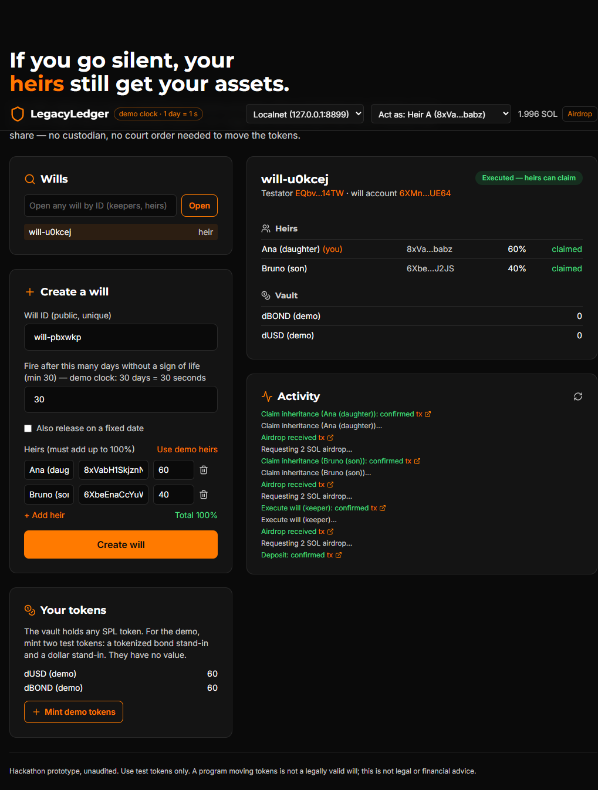

# LegacyLedger

**Dead man's switch inheritance vaults on Solana.** Lock SPL tokens in a vault controlled by a program. Send a sign of life now and then. If you go silent for longer than the threshold you chose, anyone can trigger the will, and each heir claims exactly their share. No custodian holds the keys, and no court order is needed to move the tokens.

Built for the Colosseum **Crypto World's Fair** hackathon (Superteam Argentina track).



## The problem

When the owner of self-custodied crypto dies or becomes incapacitated, nobody can prove it on-chain, so the assets just sit there. The usual workarounds are sharing a seed phrase (anyone holding it can take everything today) or a custodian (you no longer self-custody). The program turns **silence into a verifiable signal**: if the testator signs nothing for N days, the chain itself proves it.

Argentina makes this concrete. Retail investing is mainstream (BYMA reports 12.3 M people with brokerage accounts, July 2026), tokenized securities now have a regulatory sandbox (CNV RG 1150/2026), and there is **no specific rule for inheriting crypto-assets**. Sources and caveats: [`docs/research/MERCADO-ARGENTINA.md`](docs/research/MERCADO-ARGENTINA.md).

## How it works

```
Testator                         Program (PDAs)                          Heirs / anyone
────────                         ──────────────                          ──────────────
create_will(heirs %, N days) ──► Will  ─┬─ Vault (PDA authority)
deposit_asset / withdraw_asset ─────────┤   └─ VaultAsset + token account per mint
heartbeat ("I'm alive") ────────► last_heartbeat = now
                                       ...silence > N days...
                                 execute_will  ◄──────────────────────── any keeper
                                 claim_inheritance ◄──────────────────── each heir, all mints in 1 tx
```

| Instruction | Who | What it does |
|---|---|---|
| `initialize_protocol` | admin, once | Global config: min inactivity, max rules, pause switch |
| `create_will` | testator | Heirs (wallet + basis points, must sum to 100%), inactivity rule, optional date rule |
| `register_asset` / `deposit_asset` | testator | Adds an SPL mint and moves tokens into a vault-owned token account |
| `withdraw_asset` | testator | Takes tokens back while alive (any testator action also counts as a heartbeat) |
| `heartbeat` | testator | Resets the silence clock |
| `execute_will` | **anyone** | Succeeds only once an enabled rule is met (inactivity deadline or date) |
| `claim_inheritance` | each heir | Transfers the heir's share of every asset in one transaction |
| `update_rule`, `pause_protocol`, `unpause_protocol` | testator / admin | Maintenance and circuit breaker |

**Exact shares regardless of claim order.** Each claim is computed against the basis points still unclaimed (`amount × bps / unclaimed_bps`), so a 40% heir claiming first and a 60% heir claiming second both get exactly their share, and the last heir sweeps rounding dust. Covered by unit and end-to-end tests.

## Try it

### Web app

- **Hosted:** GitHub Pages, deployed by `.github/workflows/pages.yml` (URL in the repo's About box). It talks to **devnet** by default; see the deployment status below.
- **Local, fully self-contained (recommended for judging and live demos):**

```bash
# terminal 1 (Linux/macOS/WSL): local validator with the program preloaded
./scripts/demo-local.sh            # builds with the demo clock, serves http://127.0.0.1:8899

# terminal 2: the web app
cd app && npm ci --legacy-peer-deps && npm run dev   # http://localhost:3000, pick "Localnet"
```

The app ships with **four demo personas** (Testator, Heir A, Heir B, Keeper) stored in your browser, so you can play every role without installing a wallet. A regular browser wallet (Phantom, Solflare, Backpack) also works through "Act as: browser wallet".

**60-second walkthrough:** Testator → Airdrop → *Mint demo tokens* → *Create will* with *Use demo heirs* (60/40) → deposit both tokens → wait 30 s → Keeper → Airdrop → *Execute* → Heir B, then Heir A → Airdrop → *Claim*.

### Demo clock

The program has a `demo` cargo feature where **one inactivity "day" lasts one second**, so a 30-day threshold fires in 30 seconds on stage. Production builds (no feature) use real days. The UI shows a "demo clock" badge when it assumes the demo build.

### Tests

```bash
cargo test -p legacy_ledger   # 16 unit tests (share math, validation, PDAs)
npm ci && npm test            # 15 end-to-end tests on solana-test-validator
```

The end-to-end suite covers: invalid allocations, deposits across two mints, testator withdrawal, unauthorized withdrawal/heartbeat/claim, execution refused while active, execution by a third-party keeper after the silence period, both heirs receiving exactly 60% / 40% of each asset, empty vault at the end, and double-claim protection.

## Deployment status

| Environment | Status |
|---|---|
| Local validator | Working; verified end-to-end through the web app |
| Devnet | **Pending.** Program ID `GXWfB5gTPxMLDSAeeYQ3e8TZmZMqpTzfFR3yEiUuBAaM`; run `scripts/deploy-devnet.sh` with ~3 devnet SOL |
| Mainnet | Not planned before an audit |

## Stack

Anchor 1.2.0 · Solana CLI (Agave) 4.3 · Rust 1.89 · SPL Token · Next.js 16 static export · `@anchor-lang/core` · Solana wallet adapter.

```
programs/legacy-ledger/   Anchor program (instructions/, state.rs, validate.rs + unit tests)
tests/                    end-to-end tests (mocha, local validator)
app/                      web app (static export, deployable to GitHub Pages)
scripts/                  demo-local.sh, deploy-devnet.sh
docs/                     submission notes, pitch, research
```

## Security notes and known limitations

Unaudited hackathon prototype. Use test tokens only.

- **Legal validity:** moving tokens is not a valid will in any jurisdiction we checked. This is a technical rail, not legal advice.
- **Global will IDs:** a will's address derives from a public ID; someone can squat an ID (choose another). Planned: derive from the testator key.
- **Mints omitted at claim time:** the client passes the vault's mints. The web app always passes all of them; a custom client that omits one leaves that heir's share in the vault, and later claimants split it.
- **Reserved rule types** (price triggers, rebalance) exist in the data model but are not evaluated and cannot fire a will.
- **Protocol initialization** is first-come; on a real deployment it must run in the deploy script.
- **Testator key loss** is indistinguishable from death by design: the will fires after the silence period.

See [`docs/SUBMISSION.md`](docs/SUBMISSION.md) for prior work, AI use and third-party disclosures.

## License

MIT
